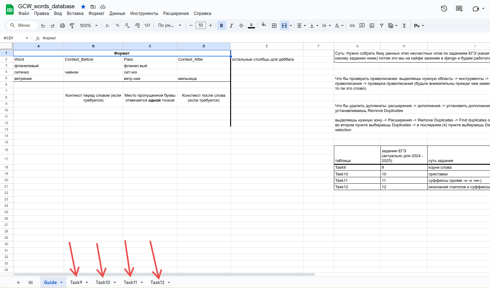
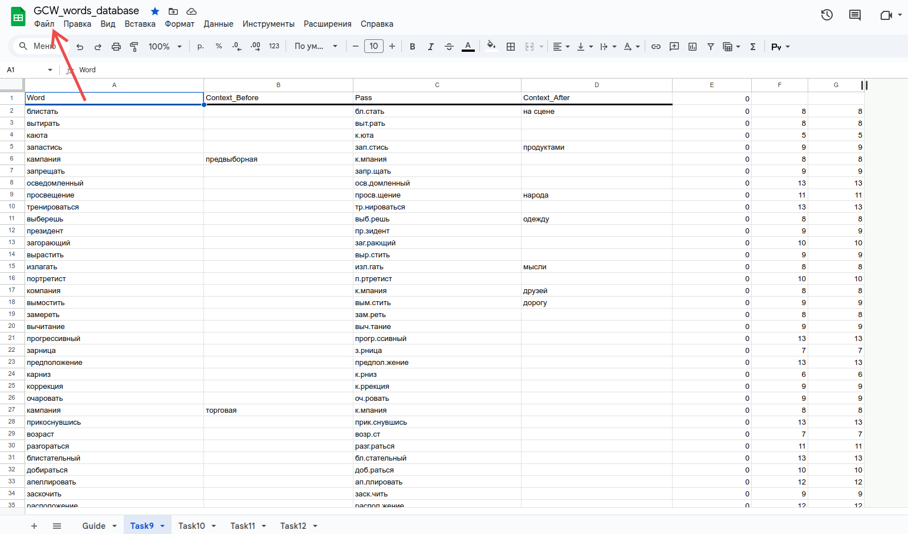
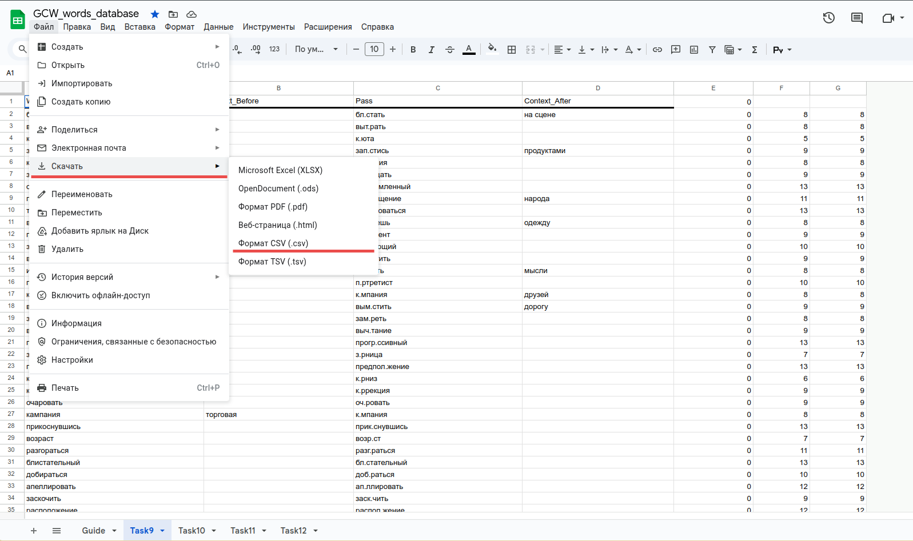
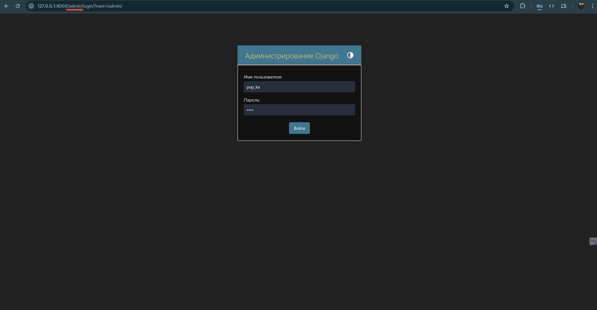
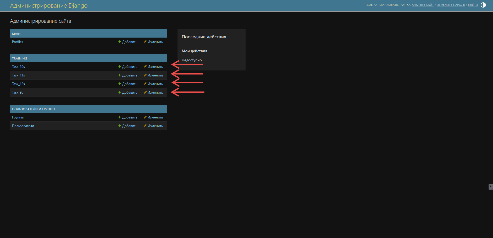
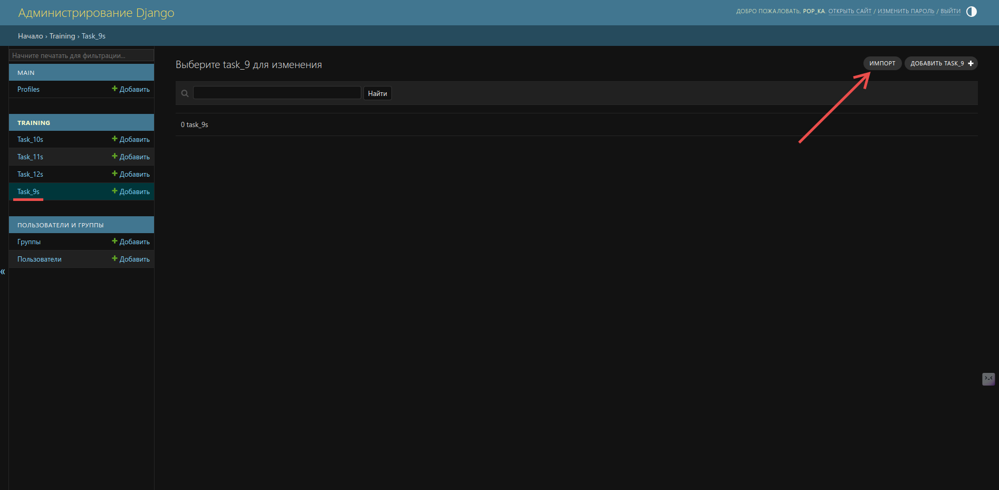
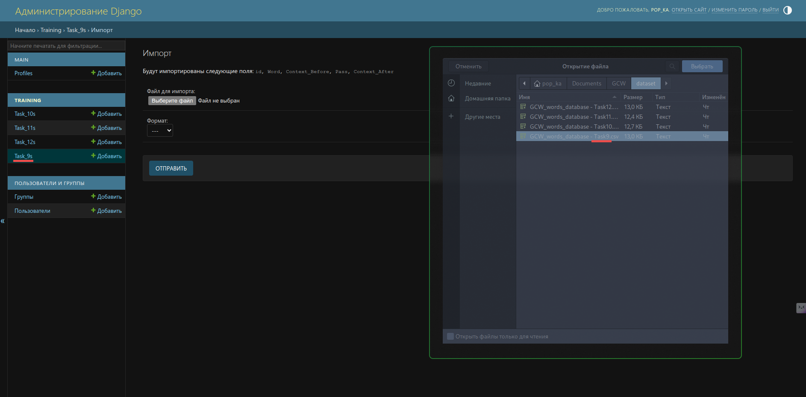
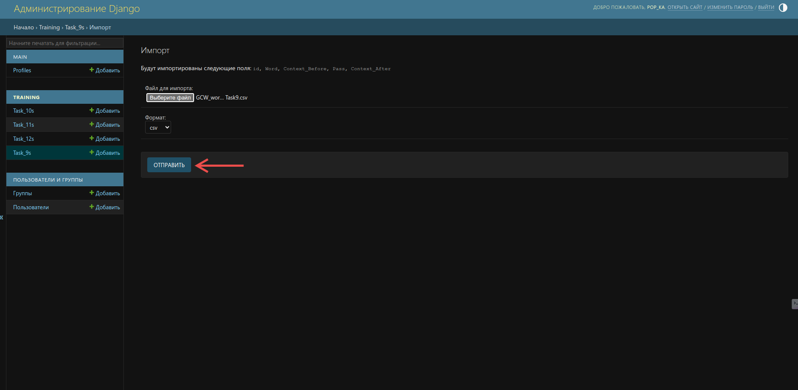
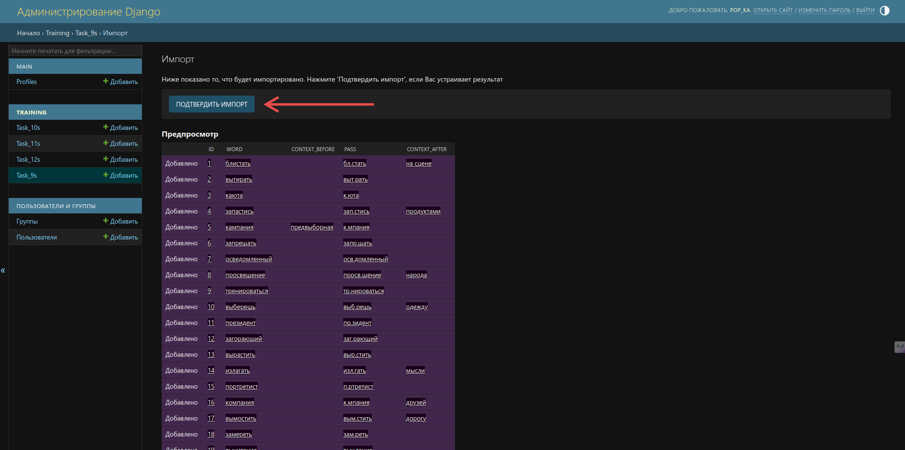

# Проект "GooseCycleWords"


[](https://popka098.github.io/django-gcw/)

### Проект доступен по ссылке https://goose-cycle.ru
### Так же можно посмотреть pages по ссылке https://popka098.github.io/django-gcw/

### Инструкция по начальной настройке проекта:

1. Обновить pip и установить все необходимое:
    ```bash
    pip install --upgrade pip
    pip install -r requirements.txt
    ```
2. Синхронизировать проект:
    ```bash
    python manage.py makemigrations
    python manage.py migrate
    python manage.py collectstatic
    ```
3. Создать суперпользователя
    ```bash
    python manage.py createsuperuser
    ```

### Добавление слов в базу данных:

1. Пройти по [ссылке](https://docs.google.com/spreadsheets/d/1YbYf7SLtEpUzzKlDy3BGpTMENcaaVtO6DuReRQio6NU/edit?usp=sharing)
   и скачать таблицы _Task9_, _Task10_, _Task11_, _Task12_ в формате **csv**

---





---

2. Зайти в админ-панель _/admin_ под аккаунтом, который был создан командой createsuperuser

---

## 

3. Загрузить таблицы соответственно моделям

---







---
